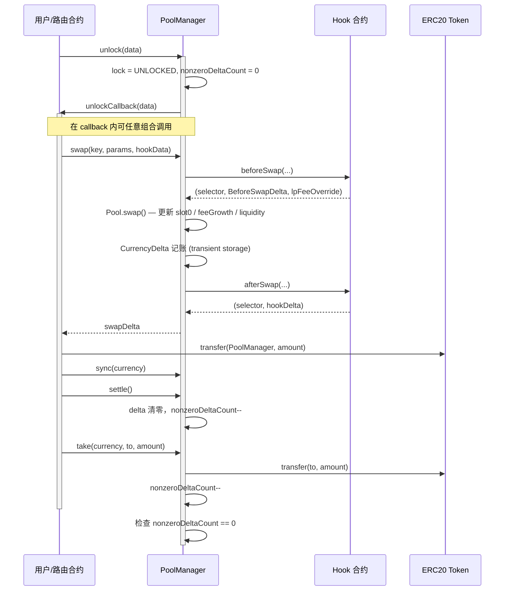
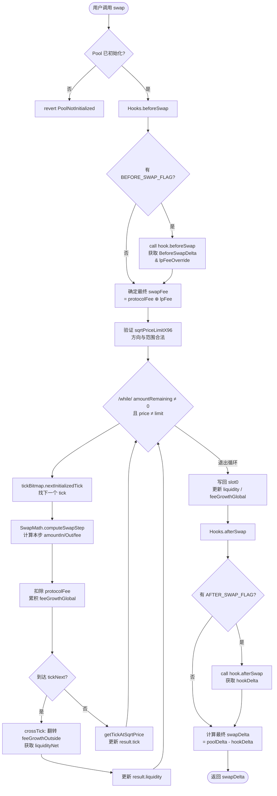
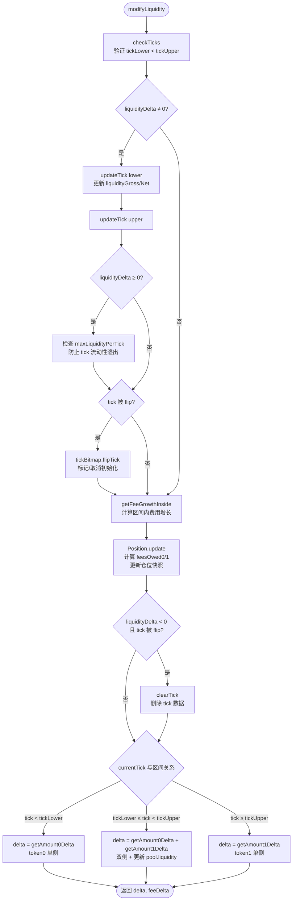
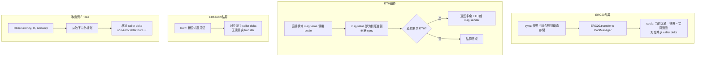
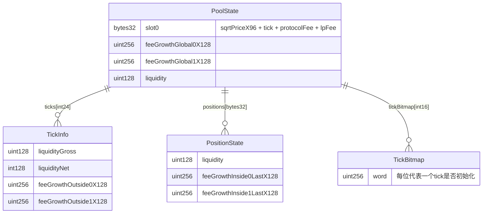

# Uniswap v4 核心流程图

---

## 1. 整体交互模型（Flash Accounting）

```mermaid
sequenceDiagram
    participant User as 用户/路由合约
    participant PM as PoolManager
    participant Hook as Hook 合约
    participant ERC20 as ERC20 Token

    User->>PM: unlock(data)
    activate PM
    PM->>PM: lock = UNLOCKED, nonzeroDeltaCount = 0
    PM->>User: unlockCallback(data)
    activate User

    Note over User,PM: 在 callback 内可任意组合调用

    User->>PM: swap(key, params, hookData)
    PM->>Hook: beforeSwap(...)
    Hook-->>PM: (selector, BeforeSwapDelta, lpFeeOverride)
    PM->>PM: Pool.swap() — 更新 slot0 / feeGrowth / liquidity
    PM->>PM: CurrencyDelta 记账 (transient storage)
    PM->>Hook: afterSwap(...)
    Hook-->>PM: (selector, hookDelta)
    PM-->>User: swapDelta

    User->>ERC20: transfer(PoolManager, amount)
    User->>PM: sync(currency)
    User->>PM: settle()
    PM->>PM: delta 清零，nonzeroDeltaCount--

    User->>PM: take(currency, to, amount)
    PM->>ERC20: transfer(to, amount)
    PM->>PM: nonzeroDeltaCount--

    deactivate User
    PM->>PM: 检查 nonzeroDeltaCount == 0
    deactivate PM
```

---

## 2. Swap 完整流程

```mermaid
flowchart TD
    A([用户调用 swap]) --> B{Pool 已初始化?}
    B -- 否 --> ERR1[revert PoolNotInitialized]
    B -- 是 --> C[Hooks.beforeSwap]

    C --> D{有 BEFORE_SWAP_FLAG?}
    D -- 是 --> E[call hook.beforeSwap\n获取 BeforeSwapDelta\n& lpFeeOverride]
    D -- 否 --> F
    E --> F[确定最终 swapFee\n= protocolFee ⊕ lpFee]

    F --> G[验证 sqrtPriceLimitX96\n方向与范围合法]
    G --> H{/while/ amountRemaining ≠ 0\n且 price ≠ limit}

    H --> I[tickBitmap.nextInitializedTick\n找下一个 tick]
    I --> J[SwapMath.computeSwapStep\n计算本步 amountIn/Out/fee]
    J --> K[扣除 protocolFee\n累积 feeGrowthGlobal]
    K --> L{到达 tickNext?}
    L -- 是 --> M[crossTick: 翻转 feeGrowthOutside\n获取 liquidityNet]
    M --> N[更新 result.liquidity]
    N --> H
    L -- 否 --> O[getTickAtSqrtPrice\n更新 result.tick]
    O --> H

    H -- 退出循环 --> P[写回 slot0\n更新 liquidity / feeGrowthGlobal]
    P --> Q[Hooks.afterSwap]
    Q --> R{有 AFTER_SWAP_FLAG?}
    R -- 是 --> S[call hook.afterSwap\n获取 hookDelta]
    R -- 否 --> T
    S --> T[计算最终 swapDelta\n= poolDelta - hookDelta]
    T --> U([返回 swapDelta])
```

---

## 3. 添加/移除流动性流程

```mermaid
flowchart TD
    A([modifyLiquidity]) --> B[checkTicks\n验证 tickLower < tickUpper]
    B --> C{liquidityDelta ≠ 0?}

    C -- 是 --> D[updateTick lower\n更新 liquidityGross/Net]
    D --> E[updateTick upper]
    E --> F{liquidityDelta ≥ 0?}
    F -- 是 --> G[检查 maxLiquidityPerTick\n防止 tick 流动性溢出]
    G --> H{tick 被 flip?}
    F -- 否 --> H
    H -- 是 --> I[tickBitmap.flipTick\n标记/取消初始化]
    I --> J
    H -- 否 --> J

    C -- 否 --> J

    J[getFeeGrowthInside\n计算区间内费用增长] --> K[Position.update\n计算 feesOwed0/1\n更新仓位快照]
    K --> L{liquidityDelta < 0\n且 tick 被 flip?}
    L -- 是 --> M[clearTick\n删除 tick 数据]
    L -- 否 --> N

    M --> N{currentTick 与区间关系}
    N -- tick < tickLower --> O[delta = getAmount0Delta\ntoken0 单侧]
    N -- tickLower ≤ tick < tickUpper --> P[delta = getAmount0Delta + getAmount1Delta\n双侧 + 更新 pool.liquidity]
    N -- tick ≥ tickUpper --> Q[delta = getAmount1Delta\ntoken1 单侧]

    O --> R([返回 delta, feeDelta])
    P --> R
    Q --> R
```

---

## 4. Hook 权限位图

```mermaid
flowchart LR
    subgraph addr["Hook 合约地址（最低14位）"]
        direction LR
        b13["bit13\nBEFORE_INIT"] --- b12["bit12\nAFTER_INIT"]
        b12 --- b11["bit11\nBEFORE_ADD_LIQ"]
        b11 --- b10["bit10\nAFTER_ADD_LIQ"]
        b10 --- b9["bit9\nBEFORE_RM_LIQ"]
        b9 --- b8["bit8\nAFTER_RM_LIQ"]
        b8 --- b7["bit7\nBEFORE_SWAP"]
        b7 --- b6["bit6\nAFTER_SWAP"]
        b6 --- b5["bit5\nBEFORE_DONATE"]
        b5 --- b4["bit4\nAFTER_DONATE"]
        b4 --- b3["bit3\nBEFORE_SWAP\nRETURNS_DELTA"]
        b3 --- b2["bit2\nAFTER_SWAP\nRETURNS_DELTA"]
        b2 --- b1["bit1\nAFTER_ADD\nRETURNS_DELTA"]
        b1 --- b0["bit0\nAFTER_RM\nRETURNS_DELTA"]
    end

    addr --> check["hasPermission:\nuint160(addr) & flag != 0"]
    check --> call["条件满足 → 调用对应 hook 函数"]
```

---

## 5. 费用结算流程（ERC20 vs ETH）

```mermaid
flowchart TD
    subgraph ERC20结算
        A1[sync: 快照当前余额到瞬态存储] --> A2[ERC20.transfer to PoolManager]
        A2 --> A3[settle: 当前余额 - 快照 = 实际到账\n对应减少 caller delta]
    end

    subgraph ETH结算
        B1[直接携带 msg.value 调用 settle] --> B2[msg.value 即为到账金额\n无需 sync]
        B2 --> B3{还有剩余 ETH?}
        B3 -- 是 --> B4[退还多余 ETH 给 msg.sender]
        B3 -- 否 --> B5[结算完成]
    end

    subgraph ERC6909结算
        C1[burn: 销毁内部凭证] --> C2[对应减少 caller delta\n无需真实 transfer]
    end

    subgraph 取出资产 take
        D1["take(currency, to, amount)"] --> D2[从池子向外转账]
        D2 --> D3[增加 caller delta\nnon-zeroDeltaCount++]
    end
```

---

## 6. Pool.State 存储布局

```mermaid
erDiagram
    PoolState {
        bytes32 slot0 "sqrtPriceX96 + tick + protocolFee + lpFee"
        uint256 feeGrowthGlobal0X128
        uint256 feeGrowthGlobal1X128
        uint128 liquidity
    }

    TickInfo {
        uint128 liquidityGross
        int128 liquidityNet
        uint256 feeGrowthOutside0X128
        uint256 feeGrowthOutside1X128
    }

    PositionState {
        uint128 liquidity
        uint256 feeGrowthInside0LastX128
        uint256 feeGrowthInside1LastX128
    }

    PoolState ||--o{ TickInfo : "ticks[int24]"
    PoolState ||--o{ PositionState : "positions[bytes32]"
    PoolState ||--o{ TickBitmap : "tickBitmap[int16]"

    TickBitmap {
        uint256 word "每位代表一个tick是否初始化"
    }
```
